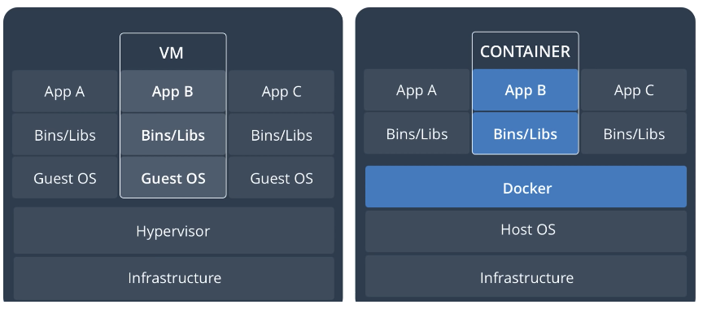
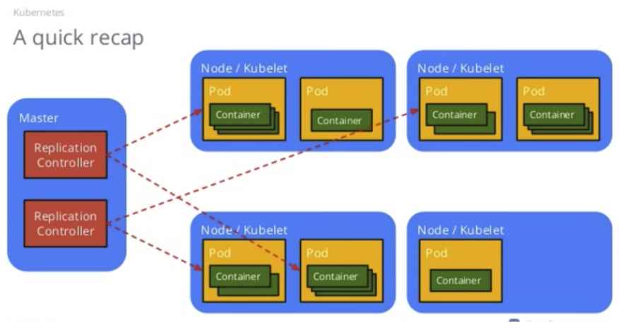
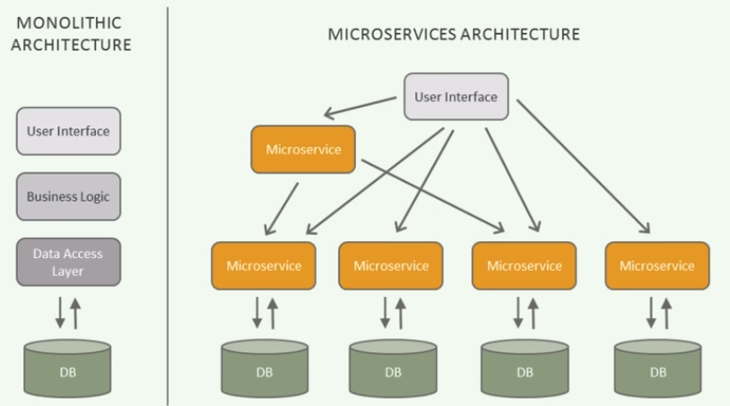

# Containers

## Virtual Machines

Virtual machines \(VMs\) are simulated computers, for example, we can have a MacOS virtual machine on a Windows PC.

## Containers \(e.g. Docker\)

Starting a Docker container is much faster than starting a VM, because no guest operating system has to be booted, which reduces the overhead. The containers share the kernel of the host OS, but have their own file system, users, network and processes. When we run a Docker container, from the perspective of the host OS we just start another process. This significantly speeds up the startup of a container while still providing a good isolation of the containers.

_Note: containers can share common bins/libs_

Docker also help to manage dependencies, so the app will behave exactly the same way on any computer that has Docker installed.

A Dockerfile contains all the commands needed to build the image and run your app. This enables "infrastructure as code", therefore it is easier for automation.

## Container Orchestration: Kubernetes

Deploying and scaling containers.

## Microservices

Separate the traditional monolith application into smaller apps, which communicate with each other with well defined APIs, usually HTTP.

Pros:

* Language independent
* Fast interaction
* Small teams
* Fault isolation
* Pair well with containers =&gt; dynamically scalable at runtime \(BIG PLUS, scale down to save money\)

Cons:

* Complex networking
* Overhead: databases, servers

## References

* [MIT Hacker Tools](https://hacker-tools.github.io/virtual-machines/)
* [Discussing Docker. Pros and Cons.](https://phauer.com/2015/discussing-docker-pros-and-cons/)
* [Introduction to Microservices, Docker, and Kubernetes](https://www.youtube.com/watch?v=1xo-0gCVhTU)



