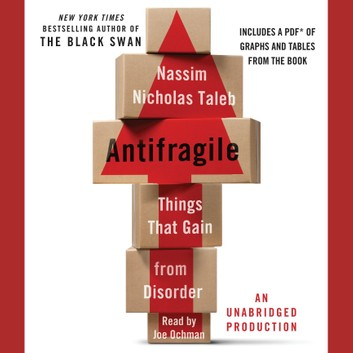

# Antifragile

脆弱的反义词不是坚强，而是“反脆弱“ - 面对环境的变动/破坏，更加强大的性质。（例如细菌耐药性）

初步的反脆弱性：【毒物兴奋效应】——说的就是小剂量的有害物质实际上会有利于机体健康，起到药物的治疗作用。一点点的危害，只要不是很多，只会造福于机体，使其成为更好的整体，因为它会触发一些【过度反应】。例如卡路里稍微偏少 - 适度饥饿 - 有利于身体健康。孟子说过：生于忧患死于安乐。

* 如果有一项紧急任务，交给最忙的人，而不是最闲的人。
* 演讲的时候最好轻声细语，而不是声嘶力竭。......让观众必须努力才能听清，这有助于他们切换到积极的思维模式下。

风险管理专业人士往往通过回顾历史来推断所谓的“最糟情境”，并据此估计未来的风险，这种方法被称为“压力测试”。他们经常把历史上最糟糕的经济衰退、最惨烈的战争、最不利的利率波动或最低的失业率作为对未来最糟糕形势的精确估计。但是，他们从来没有注意到以下矛盾——这个所谓的“最糟形势”在发生时，已经超越了当时历史上的最糟形势。

更高级别的系统 - 对于外部的不确定性显示出反脆弱性。

**反脆弱性的例子**

老谋深算的威尼斯人，知道如何通过故意隐藏信息来促进信息的传播。你可以尝试一下这个传播消息的实验：告诉别人一个秘密，并强调说这是一个秘密，恳请对方“千万不要告诉任何人”——你越是强调这是个秘密，它就传播得越快。  
  
书籍和想法都具有反脆弱性，它们都因遭查禁而广为传播。借用罗马帝国皇帝[马可·奥勒留](https://zh.wikipedia.org/wiki/%E9%A6%AC%E7%88%BE%E5%BA%AB%E6%96%AF%C2%B7%E5%A5%A7%E5%88%97%E9%87%8C%E7%83%8F%E6%96%AF)（同时也是一位[斯多葛学派](https://zh.wikipedia.org/wiki/%E6%96%AF%E5%A4%9A%E8%91%9B%E6%B4%BE)作家）的话：“有了障碍物，烈火才烧得更旺。”——这就是禁书的吸引力，它们在禁令面前显示出了反脆弱性。  
  
一本书遭到了批评，实际上说明它引起了真实的、毫不虚假的关注，表明它不是一本无聊的书。要知道，【无聊】是一本书最致命的缺陷。

好奇心是具有反脆弱性的，就像上瘾症一样，你越是满足它，这种感觉就越强烈——书籍有一种神秘的传播使命和能力，这一点对于整个房间满是图书的人来说并不陌生。（边际效益递增）

爱的反面不是恨，而是忽视。  
  
大企业和政府似乎并不明白信息的反作用力，事实上，信息有能力控制那些试图控制它的人。当你听到一家公司或一个负债累累的政府表示要“重新注入信心”，那么你就应该知道它们是脆弱的，注定失败。信息是无情的：越是召开新闻发布会来“安抚”投资者，越是会吓跑投资者，导致死亡螺旋或银行挤兑。  
  
我们常看到一个令人费解的现象，即**给我们带来最大利益的并不是那些曾试图帮助我们（比如提供“建议”）的人，而是那些曾努力伤害我们但最终未能如愿的人。**

**任何生命体似乎都有一定程度的反脆弱性。**

健康的压力：急性的，随后有恢复期。不健康的压力：长期但温和的压力（房贷？）

| **机械体/简单系统** | **有机体/复杂系统** |
| :--- | :--- |
| 需要持续修复和维护 | 自我修复 |
| 厌恶随机性 | 喜欢随机性（一定范围内） |
| 无须恢复 | 在受压后需要恢复 |
| 组成部分相互依赖【很低或没有】 | 组成部分相互依赖【很强】 |
| 【存在】压力导致材料疲劳 | 【缺乏】压力导致萎缩 |
| 【常用】导致老化 | 【闲置】导致老化 |
| 在冲击下会反应【不足】 | 在冲击下会反应【过度】 |

如果你还活着，你的内心深处就会喜欢一定程度的随机性和混乱。......**如果我能预测我未来每一天的轨迹，那我会觉得自己身体的一部分已经死了。**

**反脆弱性的层级**

生物进化，自然选择：每个个体是脆弱的，但是整个物种是反脆弱的。细菌的抗生素耐药性。

没有什么东西会永垂不朽，因为自然界是混沌系统，无法精确预测。

**一般性错误与系统性错误**

每一次飞机失事都让我们离安全更近一步，因为我们会改进系统，使下一次的飞行更安全——失事人员为其他人的总体安全做出了贡献。......这些系统之所以善于吸取教训，是因为它们具有反脆弱性，它们本身就能够利用微小的错误改进自身。 但是，经济崩溃就不一样了，因为经济系统的反脆弱方式与我们到目前为止所论及的方式并不相同。为什么呢？我们知道，每年有成百上千的航班在空中往返，一架飞机坠毁并不会牵连其他飞机，因而，错误的影响有限，错误的原因也相当明确；然而，全球化经济体系却是以一个整体在运作——错误会快速传播，并愈加复杂。 ...... 如果说每一次飞机失事都降低了下一次事故的发生概率，那么每一家银行的崩溃却会提高下一家银行崩溃的概率。要建立一个理想的社会经济系统，我们必须消除第二种类型的错误（系统性错误），即容易蔓延或传染的错误。

**我对失败者的特征描述就是，失败者往往在犯错后不内省、不探究，觉得难堪，听不得批评，试图解释自己的错误而不是用新的信息丰富自己，并开始新的历程。这些人往往视自己为“受害者”，受制于某个大阴谋、糟糕的老板或恶劣的天气。** \(see [here](../life.md)\)

美国政府bailout大企业，恰恰是破坏了企业的脆弱性，削弱了整个经济体的反脆弱性。

随机性并不意味着风险。出租车司机的收入每天有波动，但是比大公司人事部门的职位更稳定。（**COVID-19例外，哈哈 writing idea**）很多小雇主和一个大雇主的关系。

人为的稳定 - 消除自然随机性 - 有时是危险的，因为它掩盖了更大的深层的问题。小型森林火灾能够去除最易燃的树木，防止大型火灾。小型地震能及时释放板块应力，避免大地震。

经济周期不应过度干预。（必要的干预是可以的）**（这话说了跟没说一样，事后诸葛亮谁不会当？什么叫过度？当局者迷啊）**

建立在“自以为理解了事件发生概率的错觉”之上的系统注定要崩溃。 ...... 通常说来，你无法准确地预测未来；但你可以预测到——那些依靠预测行事的人往往会承受更大的风险。......为什么呢？因为预测者在预测误差面前是脆弱的。

**基础的不对称性**  
......  
想知道为什么不对称性能像波动性一样带来回报？只要想一下，如果你失去的比得到的少，有利因素比不利因素少，那么你会喜欢波动性（波动性总体来说会给你带来好处），你也就是反脆弱性的。  
......  
我的工作就是用基础不对称结构将以下4个要素联系起来。  
**脆弱性等于失去的比得到的更多，等于不利因素比有利因素更多，即等于【不利的】不对称性。  
反脆弱性等于得到的比失去的更多，等于有利因素比不利因素更多，即等于【有利的】不对称性。**

选择权的一个属性是：它并不关心平均结果，而只关心有利因素（因为不利因素并不会超过某一界限）。  
......  
想想这个简单的启发法：你的作品和思想，无论是在政治、艺术或其他领域，都不受大部分人的认可（甚至有人极其反感），但却有一小撮极为忠诚和热心的拥趸，这种情况较之百分之百的人都觉得你可以接受或勉强值得称道，哪种情况对你更有利？当然是前一种。选择权喜欢分散的结果，而不太关心平均值。

法国伟大的生物学家弗朗索瓦·雅各布将自然生态系统中的选择权概念（或类似选择权式的特点）引入了科学领域，这就是【试错】的概念。 ...... 试错过程中我们会犯小错误，但却能获得大收益，我们不妨称其为“自由探索”（tinkering）。事实上，有一个词可以更准确地描述这种积极的不对称性，这就是【凸性】，我们将在第18章中深入阐述。 ...... 这是一种与期权类似的试错机制（快速失败模型），又名“凸性自由探索”。在这一机制下，错误的成本低，最大损失是已知的，而潜在回报则是巨大的（无限）。正面“黑天鹅”的一个重要特征：收益是无限的（这与彩票不同），或者更确切地说，其界限是未知的；但错误所带来的损失则是有限和已知的。

试错法有一种人们还未理解的首要价值：它其实【不是】随机的！由于可选择性的存在，它需要一定的理性：它需要你以一定的智慧来识别有利的结果，以及知道该放弃什么。  
为了让试错过程不完全是随机性的，你需要保持理性。如果你在客厅寻找不知道放到哪里去的钱包，那么在采用试错法时，你的理性就在于，同一个地方不必寻找两次。这样，在找寻过程中，每一次尝试、每一次失败都能提供额外的信息，每一个信息都比前一个信息更有价值，因为你越来越清楚，哪些方法是无用的，或者在哪些地方不可能找到钱包。  
......  
**我们从失败的尝试中能够逐渐摸索出正确的方向。**

让我们来看看两种类型的知识。 第一类不完全是“知识”，其模糊的特性让我们很难将其与严格定义的知识联系起来。这是一种我们无法用明确和直接的语言表达的做事方式——有时我们称其为否定法——但是，我们却切切实实地身体力行，而且做得很好。 第二类更像我们平常所说的“知识”，它是你在学校里学会的东西，是你用来获得分数的东西，可以写成文章、可以解释、可以做学术、可以理性化、可以形式化、可以理论化、可以苏联化、可以官僚化、可以哈佛化，也是可以证明的。

知识和有组织的教育并非一回事。信仰和有组织的宗教也并非一回事。

14章已看完。

