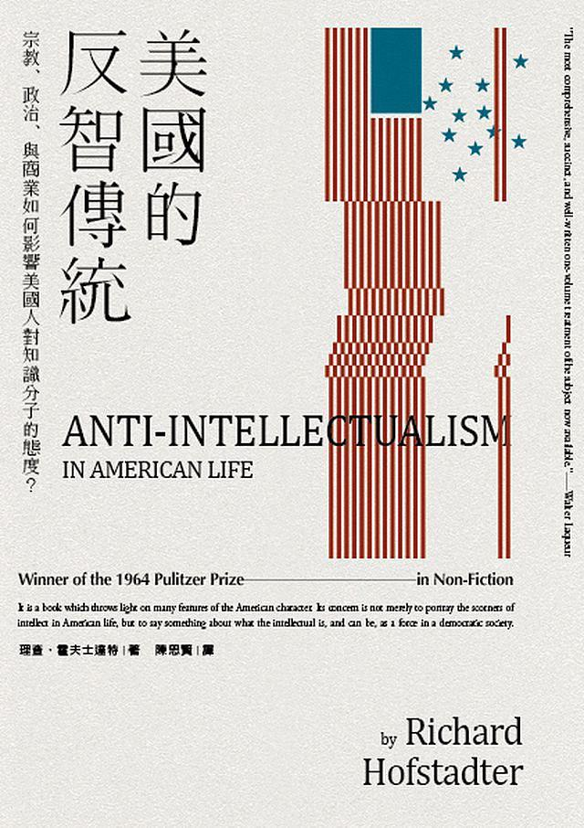

# Anti-Intellectualism in American Life 美国的反智传统

在川普当选后，此书显得非常先知先觉。我并未读正文，推荐序和译序总结了正文内容如下：（另外竖排的书实在是太不习惯了……）

美国的反智传统来源于以下四种力量：

* **宗教** - 美国建国来源之一为新教徒追求宗教自由。他们为了摆脱欧洲天主教的旧体制，强调个人宗教体验，不强调传统的神学研究。
* **民主** - 美国开国元勋都是精英，但设计的民主体制强调人人生而平等，并不强调领导者需要学识渊博。
* **商业** - 美国商业环境强调吃苦耐劳的实干精神，并不强调知识的重要性。
* **教育** - 美国教育的重点是人格的培养而非具体知识的掌握。教育目标是培养能参与美式民主、商业社会的人。

