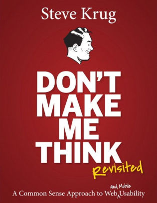

# Don't Make Me Think

## Summary

Do usability test for your website, one morning per month, on three users. \(You can find more problems in half a day than you can fix in a month.\) Do not assume the users think like you \(the designer/developer\).

David Feng Note - This is actually the biggest challenge in content delivery in general: the presenter has to know the audience; the writer has to know the reader; the teacher has to know the students; and the designer/developer has to know the user. Usually the former has been thinking about this particular issue for a long time. they have all the context, and assume the latter does too. However, it is not true. The quickest way to know the truth is to ask people to use your website \(usability test\).

## How We Really Use the Web

* We don’t read pages. We scan them. =&gt; make your content scan-friendly! **Use plenty of headings**. Keep paragraphs short.
* We don’t make optimal choices. We satisfice \(satisfy + suffice\).
* We don’t figure out how things work. We muddle through.

## How to Give Guidance

* Give me as much guidance as I need — but no more. \(a similar one: use as much space as necessary, but don’t use any more space than necessary. Quotes like this seem to tell you nothing, but they are actually saying something worth thinking about. Similar to all the "lean" philosophy, e.g. lean design, lead lean, just do enough\)
* Your objective should always be to eliminate instructions entirely by making everything self-explanatory, or as close to it as possible. When instructions are absolutely necessary, cut them back to the bare minimum.
* We often assume user would click certain times to reach a certain page. However, the reality is that we’re often dropped down in the middle of a site with no idea where we are because we’ve followed a link from a search engine, a social networking site, or email from a friend, and we’ve never seen this site’s navigation scheme before.

## Interesting Quotes

* A person of average \(or even below average\) ability and experience can figure out how to use the thing to accomplish something without it being more trouble than it’s worth.
* Innovate when you know you have a better idea, but take advantage of conventions when you don’t.
* Too-subtle visual cues are actually a very common problem.
* You want to be relying solely on the overall appearance of things, not the details.
* Testing one user early in the project is better than testing 50 near the end.
* It’s a good idea to do a test of competitive sites. Because it’s not your site being tested, no one has anything personally on the line.
* Headings should be closer to the following text.

