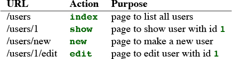
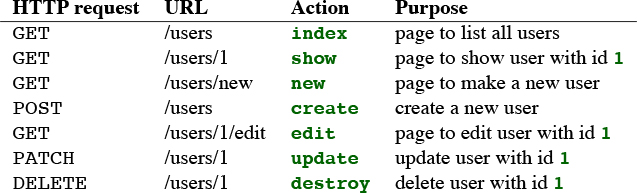

# Rails

## 1. Hello-world app

### Start a new project

```bash
gem install rails
# or gem install rails -v 6.0.0

# confirm rails version
rails -v
Rails 6.0.2.2

# also need to install yarn

rails new my_app

cd my_app
bundle install
rails s

# go to http://localhost:3000
```


### Gemfile

```ruby
gem 'rails' # installs latest rails

# installs latest capybara, later than v2.15
gem 'capybara', '>= 2.15' 

# install 6.0.1 (if available) but not 6.1.0
gem 'rails', '~> 6.0.0'
```

### Hello-World app

```ruby
# app/controllers/application_controller.rb
class ApplicationController < ActionController::Base

  def hello
    render html: "hello, world!"
  end
end

# config/routes.rb

Rails.application.routes.draw do
  root 'application#hello'
end
```

## 2. Toy App

### models

* users: id \(int\), name \(string\), email \(string\)
* microposts: id \(int\), content \(text\), user\_id \(int\)

```bash
$ rails generate scaffold User name:string email:string
....
$ rails db:migrate
```




```ruby
Rails.application.routes.draw do
  resources :users
  root 'users#index'
end
```




### More models

```ruby
#app/models/user.rb

class User < ApplicationRecord
  has_many :microposts # association
end

# app/models/micropost.rb

class Micropost < ApplicationRecord
  belongs_to :user # association
  validates :content, length: { maximum: 140 },
                      presence: true # validation
end

# to confirm, use rails console
$ rails c
User.first
...
User.first.microposts
...
```

## 3. Sample App

