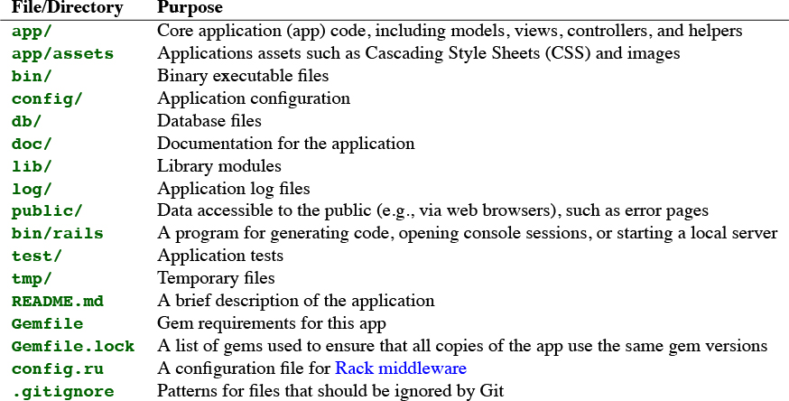
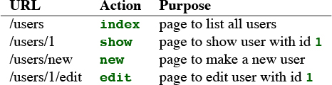
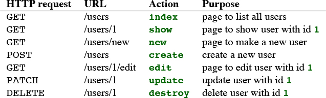

# Rails

## 1. Hello-world app

### Start a new project

```bash
gem install rails
# or gem install rails -v 6.0.0

# confirm rails version
rails -v
Rails 6.0.2.2

# also need to install yarn

rails new my_app

cd my_app
bundle install
rails s

# go to http://localhost:3000
```



### Gemfile

```ruby
gem 'rails' # installs latest rails

# installs latest capybara, later than v2.15
gem 'capybara', '>= 2.15' 

# install 6.0.1 (if available) but not 6.1.0
gem 'rails', '~> 6.0.0'
```

### Hello-World app

```ruby
# app/controllers/application_controller.rb
class ApplicationController < ActionController::Base

  def hello
    render html: "hello, world!"
  end
end

# config/routes.rb

Rails.application.routes.draw do
  root 'application#hello'
end
```

## 2. Toy App

### models

* users: id \(int\), name \(string\), email \(string\)
* microposts: id \(int\), content \(text\), user\_id \(int\)

```bash
$ rails generate scaffold User name:string email:string
....
$ rails db:migrate
```




```ruby
Rails.application.routes.draw do
  resources :users
  root 'users#index'
end
```




### More models

```ruby
#app/models/user.rb

class User < ApplicationRecord
  has_many :microposts # association
end

# app/models/micropost.rb

class Micropost < ApplicationRecord
  belongs_to :user # association
  validates :content, length: { maximum: 140 },
                      presence: true # validation
end

# to confirm, use rails console
$ rails c
User.first
...
User.first.microposts
...
```

## 3. Sample App

```bash
rails t # run tests
rails g controller ControllerName <optional action names> # g is short for generate
# undo
rails destroy controller ControllerName <optional action names>
# generate / destroy models
rails generate model User name:string email:string
rails destroy model User

rails db:migrate
rails db:rollback
rails db:migrate VERSION=0
```

## 4. Rails-flavored Ruby

### Strings

```ruby
rails c
# By default, the console starts in a development environment

# string interpolation (does not work for single quoted strings)
"Hello, #{name}!"

'\n' is the same as "\\n"

# print string
>> puts "foo"
foo
=> nil # puts returns nil
>> print "foo" # print string without extra line
foo=> nil

# string methods
>> "foobar".empty?     # methods that return a boolean
=> false

>> "foobar".length     # Passing the "length" message to a string
=> 6

# .reverse for a string
```

### Methods

```ruby
# if/elsif/else end
# && || !
nil.to_s # convert to string
1.nil?
=> false

puts "this" if 1.nil?
puts "that" unless 2.nil?

# only nil and false are falsey in Ruby. 0 is truthy.
# !!object => boolean

def func(str='') # default value
  ...
end

func # when no argument is provided, we don't even need () to invoke it

# method implicit returns the last statement value
# or you can use "return"
```

### Other data structures

#### Arrays and Ranges

```ruby
# string to array
>> "foo bar baz".split # Split a string into a three-element array.
=> ["foo", "bar", "baz"]
>> "fooxbarxbaz".split('x')
=> ["foo", "bar", "baz"]

# array to string
>> a
=> [42, 8, 17, 6, 7, "foo", "bar"]
>> a.join                      # Join on nothing.
=> "4281767foobar"
>> a.join(', ')                # Join on comma-space.
=> "42, 8, 17, 6, 7, foo, bar"

# access elements in array
# -1, (Rails) first, second, last
# common array methods
# empty? include? sort sort! reverse reverse! shuffle shuffle!
# bang methods modify the array
# push / <<
# array can contain elements with different kind (e.g. integer and string)

# range
# to_a: convert to array
>> 0..9 => 0..9
>> 0..9.to_a              # Oops, call to_a on 9.
NoMethodError: undefined method `to_a' for 9:Fixnum
>> (0..9).to_a            # Use parentheses to call to_a on the range.
=> [0, 1, 2, 3, 4, 5, 6, 7, 8, 9]

>> a = %w[foo bar baz quux]        # Use %w to make a string array.
=> ["foo", "bar", "baz", "quux"]
>> a[0..2]
=> ["foo", "bar", "baz"]

>> a = (0..9).to_a
=> [0, 1, 2, 3, 4, 5, 6, 7, 8, 9]
>> a[2..(a.length-1)]               # Explicitly use the array's length.
=> [2, 3, 4, 5, 6, 7, 8, 9]
>> a[2..-1]                         # Use the index -1 trick.
=> [2, 3, 4, 5, 6, 7, 8, 9]

# range with characters
>> ('a'..'e').to_a
=> ["a", "b", "c", "d", "e"]
```

#### Blocks

```ruby
>> (1..5).each { |i| puts 2 * i }
2
4
6
8
10
=> 1..5

# multi-line block
>> (1..5).each do |i|
?> puts 2 * i
>> end

>> 3.times { puts "Betelgeuse!" }   # 3.times takes a block with no variables.
"Betelgeuse!"
"Betelgeuse!"
"Betelgeuse!"
=> 3
>> (1..5).map { |i| i**2 }          # The ** notation is for 'power'.
=> [1, 4, 9, 16, 25]
>> %w[a b c]                        # Recall that %w makes string arrays.
=> ["a", "b", "c"]
>> %w[a b c].map { |char| char.upcase }
=> ["A", "B", "C"]
>> %w[A B C].map { |char| char.downcase }
=> ["a", "b", "c"]
>> %w[A B C].map(&:downcase) # symbol-to-proc
=> ["a", "b", "c"]
```

#### Hashes and symbols

```ruby
# hashes
>> user = {}                          # {} is an empty hash.
=> {}
>> user["first_name"] = "Michael"     # Key "first_name", value "Michael"
=> "Michael"
>> user["last_name"] = "Hartl"        # Key "last_name", value "Hartl"
=> "Hartl"
>> user["first_name"]                 # Element access is like arrays.
=> "Michael"
>> user                               # A literal representation of the hash
=> {"last_name"=>"Hartl", "first_name"=>"Michael"}
>> user[:password]          # Access the value of an undefined key.
=> nil

# usually the keys of hashes are symbols, not strings
:name # symbols are hashes without baggages, faster to compare equality
>> h1 = { :name => "Michael Hartl", :email => "michael@example.com" }
=> {:name=>"Michael Hartl", :email=>"michael@example.com"}
>> h2 = { name: "Michael Hartl", email: "michael@example.com" }
=> {:name=>"Michael Hartl", :email=>"michael@example.com"}
>> h1 == h2
=> true

# hashes can use blocks
>> flash = { success: "It worked!", danger: "It failed." }
=> {:success=>"It worked!", :danger=>"It failed."}
>> flash.each do |key, value|
?>    puts "Key #{key.inspect} has value #{value.inspect}"
>> end
Key :success has value "It worked!"
Key :danger has value "It failed."

# p, puts, inspect
>> (1..5).to_a
=> [1, 2, 3, 4, 5]
>> (1..5).to_a.inspect
=> "[1, 2, 3, 4, 5]" # inspect returns the literal representation
>> puts (1..5).to_a              # Put an array as a string.
1
2
3
4
5
=> nil
>> puts (1..5).to_a.inspect      # Put a literal array.
[1, 2, 3, 4, 5]
=> nil
>> p (1..5).to_a # p prints the literal and returns the object
[1, 2, 3, 4, 5]
=> [1, 2, 3, 4, 5]
```

#### helper function revisit

```ruby
<%= stylesheet_link_tag 'application', media: 'all',
                                      'data-turbolinks-track': 'reload' %>
                                      
# Parentheses on function calls are optional.
# This:
stylesheet_link_tag('application', media: 'all',
                                   'data-turbolinks-track': 'reload')
# is the same as this:
stylesheet_link_tag 'application', media: 'all',
                                   'data-turbolinks-track': 'reload'

# Curly braces on final hash arguments are optional.
# This:
stylesheet_link_tag 'application', { media: 'all',
                                    'data-turbolinks-track': 'reload' }
# is the same as this:
stylesheet_link_tag 'application', media: 'all',
                                   'data-turbolinks-track': 'reload'
```

### Ruby Classes

```ruby
# String
>> s = "foobar"      # A literal constructor for strings using double quotes
=> "foobar"
>> s.class
=> String

>> s = String.new("foobar")         # A named constructor for a string
=> "foobar"
>> s.class
=> String
>> s == "foobar"
=> true

# Array
>> a = Array.new([1, 3, 2])
=> [1, 3, 2]

# Hash
>> h = Hash.new
=> {}
>> h[:foo]              # Try to access the value for the nonexistent key :foo.
=> nil
>> h = Hash.new(0)      # Arrange for nonexistent keys to return 0 instead of nil.
=> {}
>> h[:foo]
=> 0

# the new method is a class method
# 'foobar'.length length is a instance method

# inheritance
>> s = String.new("foobar")
=> "foobar"
>> s.class                          # Find the class of s.
=> String
>> s.class.superclass               # Find the superclass of String.
=> Object
>> s.class.superclass.superclass    # Ruby has a BasicObject base class as of 1.9
=> BasicObject
>> s.class.superclass.superclass.superclass
=> nil

>> class Word < String              # Word inherits from String.
>>    # Returns true if the string is its own reverse.
>>  def palindrome?
>>    self == self.reverse          # self is the string itself.
      # inside of the class, the use of 'self.' is optional on a method or
      # attribute, unless we are making an assignment.
      # so this line can also be written as self == reverse
>>  end
>> end

>> s = Word.new("level")    # Make a new Word, initialized with "level".
=> "level"
>> s.palindrome?            # Words have the palindrome? method.
=> true
>> s.length                 # Words also inherit all the normal string methods.
=> 5

# monkey patching built-in class
>> class String
>>  # Returns true if the string is its own reverse.
>>  def palindrome?
>>    self == self.reverse
>>  end
>> end
=> nil
>> "deified".palindrome?
=> true

# An example
class User
  # creates getters and setters for instance variables @name @email
  attr_accessor :name, :email

  # constructor, the method being called when User.new(...)
  def initialize(attributes = {})
    @name = attributes[:name]
    @email = attributes[:email]
  end

  def formatted_email
    "#{@name} <#{@email}>"
  end
end

# in irb
>> require './example_user'     # This is how you load the example_user code.
=> true
```

## 5. Filling in the layout


