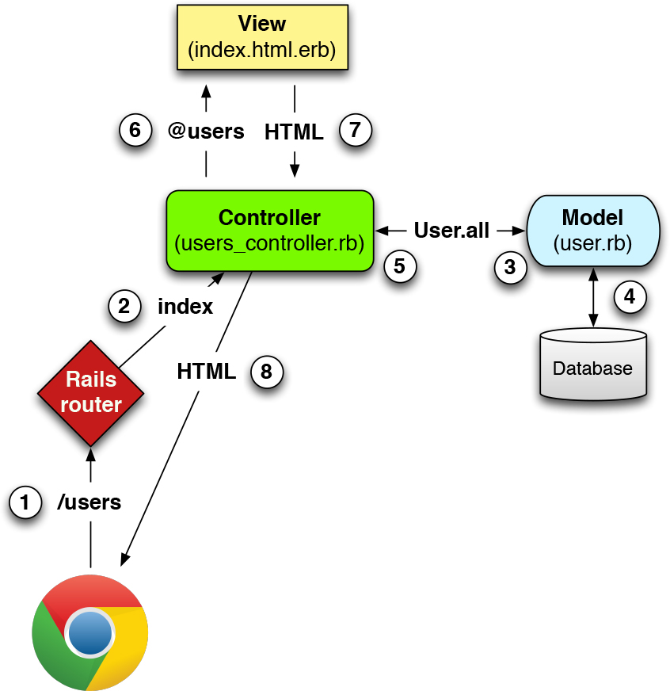
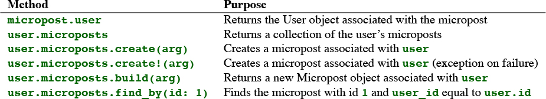

# Rails

## 1. Hello-world app

### Start a new project

```bash
gem install rails
# or gem install rails -v 6.0.0

# confirm rails version
rails -v
Rails 6.0.2.2

# also need to install yarn

rails new my_app

cd my_app
bundle install
rails s

# go to http://localhost:3000
```


### Gemfile

```ruby
gem 'rails' # installs latest rails

# installs latest capybara, later than v2.15
gem 'capybara', '>= 2.15' 

# install 6.0.1 (if available) but not 6.1.0
gem 'rails', '~> 6.0.0'
```

### Hello-World app

```ruby
# app/controllers/application_controller.rb
class ApplicationController < ActionController::Base

  def hello
    render html: "hello, world!"
  end
end

# config/routes.rb

Rails.application.routes.draw do
  root 'application#hello'
end
```

## 2. Toy App

### models

* users: id \(int\), name \(string\), email \(string\)
* microposts: id \(int\), content \(text\), user\_id \(int\)

```bash
$ rails generate scaffold User name:string email:string
....
$ rails db:migrate
```



```ruby
Rails.application.routes.draw do
  resources :users
  root 'users#index'
end
```



### More models

```ruby
#app/models/user.rb

class User < ApplicationRecord
  has_many :microposts # association
end

# app/models/micropost.rb

class Micropost < ApplicationRecord
  belongs_to :user # association
  validates :content, length: { maximum: 140 },
                      presence: true # validation
end

# to confirm, use rails console
$ rails c
User.first
...
User.first.microposts
...
```



## 3. Sample App

```bash
rails t # run tests
rails g controller Users new <new is optional action names> # g is short for generate
# undo
rails destroy controller ControllerName <optional action names>
# generate / destroy models
rails generate model User name:string email:string
rails destroy model User # or use d for short

rails db:migrate
rails db:rollback
rails db:migrate VERSION=0
# controller and data table is plural. Model is singular

```

### User Model

```ruby
rails generate model User name:string email:string

# rails generates this migration file
# db/migrate/[timestamp]_create_users.rb
class CreateUsers < ActiveRecord::Migration[6.0] 
  def change
    create_table :users do |t|
      t.string :name
      t.string :email

      t.timestamps # creates two magic columns: created_at, updated_at
    end
  end
end


## create a user

rails c --sandbox
Loading development environment in sandbox
Any modifications you make will be rolled back on exit
>> User.new
=> #<User id: nil, name: nil, email: nil, created_at: nil, updated_at: nil>
>> user = User.new(name: "Michael Hartl", email: "michael@example.com")
=> #<User id: nil, name: "Michael Hartl", email: "michael@example.com",
created_at: nil, updated_at: nil>
>> user.valid?
true
# once we have validation, save may fail
# use user.errors.full_messages to see what failed
>> user.save
    (0.1ms) SAVEPOINT active_record_1
  SQL (0.8ms) INSERT INTO "users" ("name", "email", "created_at",
  "updated_at") VALUES (?, ?, ?, ?) [["name", "Michael Hartl"],
  ["email", "michael@example.com"], ["created_at", "2019-08-22 01:51:03.453035"],
  ["updated_at", "2019-08-22 01:51:03.453035"]]
    (0.1ms) RELEASE SAVEPOINT active_record_1
=> true
>> user # now user has id, created_at, updated_at values
=> #<User id: 1, name: "Michael Hartl", email: "michael@example.com",
created_at: "2019-08-22 01:51:03", updated_at: "2019-08-22 01:51:03">

# accesss attributes
>> user.name
=> "Michael Hartl"
>> user.email
=> "michael@example.com"
>> user.updated_at
=> Thu, 22 Aug 2019 01:51:03 UTC +00:00

# User.create = User.new + User.save. It returns the created object itself
>> foo = User.create()
>> foo.destroy #returns foo. Removes foo from db, but still exist in memory


## find a user
>> User.find(1)
>> User.find_by(email: "michael@example.com")
=> #<User id: 1, name: "Michael Hartl", email: "michael@example.com",
created_at: "2019-08-22 01:51:03", updated_at: "2019-08-22 01:51:03">
# other methods: User.first, User.all (returns an array)
# take first 6 users: User.order(:created_at).take(6)


## update a user
# method 1
>> user           # Just a reminder about our user's attributes
=> #<User id: 1, name: "Michael Hartl", email: "michael@example.com",
created_at: "2019-08-22 01:51:03", updated_at: "2019-08-22 01:51:03">
>> user.email = "mhartl@example.net"
=> "mhartl@example.net"
>> user.save
=> true
# remember to save to db. You can reload a user from db.
>> user.email
=> "mhartl@example.net"
>> user.email = "foo@bar.com"
=> "foo@bar.com"
>> user.reload.email
=> "mhartl@example.net"

# method 2
>> user.update(name: "The Dude", email: "dude@abides.org")
=> true
>> user.name
=> "The Dude"
>> user.email
=> "dude@abides.org"

# method 3
# updates single attribute, skip validation
>> user.update_attribute(:name, "El Duderino")
=> true
>> user.name
=> "El Duderino"


## Validation

#app/models/user.rb

class User < ApplicationRecord
  # callback
  # on the right hand side of assignment, self. is optional
  before_save { self.email = email.downcase }
  # or before_save { email.downcase! }
  validates :name,  presence: true, length: { maximum: 50 }
  VALID_EMAIL_REGEX = /\A[\w+\-.]+@[a-z\d\-.]+\.[a-z]+\z/i
  validates :email, presence: true, length: { maximum: 255 },
                    format: { with: VALID_EMAIL_REGEX },
                    uniqueness: true
end

#test/models/user_test.rb

require 'test_helper'

class UserTest < ActiveSupport::TestCase

  def setup
    @user = User.new(name: "Example User", email: "user@example.com")
  end

  test "should be valid" do
    assert @user.valid?
  end
  
  # validate presense
  test "name should be present" do
    @user.name = " "
    assert_not @user.valid?
  end

  # validate length
  test "name should not be too long" do
    @user.name = "a" * 51
    assert_not @user.valid?
  end

  test "email should not be too long" do
    @user.email = "a" * 244 + "@example.com"
    assert_not @user.valid?
  end
  
  # validate email format
  test "email validation should accept valid addresses" do
    valid_addresses = %w[user@example.com USER@foo.COM A_US-ER@foo.bar.org
                         first.last@foo.jp alice+bob@baz.cn]
    valid_addresses.each do |valid_address|
      @user.email = valid_address
      assert @user.valid?, "#{valid_address.inspect} should be valid"
    end
  end

  test "email validation should reject invalid addresses" do
    invalid_addresses = %w[user@example,com user_at_foo.org user.name@example.
                           foo@bar_baz.com foo@bar+baz.com]
    invalid_addresses.each do |invalid_address|
      @user.email = invalid_address
      assert_not @user.valid?, "#{invalid_address.inspect} should be invalid"
    end
  end
  
  # validate uniqueness
  test "email addresses should be unique" do
    duplicate_user = @user.dup
    @user.save
    assert_not duplicate_user.valid?
  end
  
  test "email addresses should be saved as lower-case" do
    mixed_case_email = "Foo@ExAMPle.CoM"
    @user.email = mixed_case_email
    @user.save
    assert_equal mixed_case_email.downcase, @user.reload.email
  end
end

# run all tests
$ rails test:models
```

Why we need to enforce database level uniqueness in addition to ActiveRecord uniqueness validation?

1. Alice signs up for the sample app, with address alice@wonderland.com.
2. Alice accidentally clicks on “Submit” _twice_, sending two requests in quick succession.
3. The following sequence occurs: request 1 creates a user in memory that passes validation, request 2 does the same, request 1’s user gets saved, request 2’s user gets saved.
4. Result: two user records with the exact same email address, despite the uniqueness validation

Solution: enforce uniqueness on db level by creating index on the email column, then require that index to be unique.

```ruby
$ rails generate migration add_index_to_users_email
# The Rails Way™ is to use migrations every time we 
# discover that our data model needs to change.

# db/migrate/[timestamp]_add_index_to_users_email.rb
class AddIndexToUsersEmail < ActiveRecord::Migration[6.0]
  def change
    add_index :users, :email, unique: true
  end
end

$ rails db:migrate
```

\(If the migration fails, make sure to exit any running sandbox console sessions, which can lock the database and prevent migrations.\)

### Password

```ruby
class User < ApplicationRecord
  .
  .
  .
  has_secure_password 
  # need an attribute called password_digest to work
  # need bcrypt gem (and bundle install)
  # has_secure_password's validation allows six spaces as a password
  validates :password, presence: true, length: { minimum: 6 }
end

# this line does several things:
# 1. User can save to password_digest attribute, if User has it.
# 2. Two virtual attributes (only present in data model, not saved to db)
# password and password_confirmation, and adds validation that upon user 
# creation, they should
# be present and match
# 3. An authenticate method that returns the user when the password is 
# correct (and false otherwise)

$ rails generate migration add_password_digest_to_users password_digest:string

# it’s convenient to end the name with to_users, since in this case Rails
# automatically constructs a migration to add columns to the users table.
$ rails db:migrate

# in the test
require 'test_helper'

class UserTest < ActiveSupport::TestCase

  def setup
    @user = User.new(name: "Example User", email: "user@example.com",
                     password: "foobar", password_confirmation: "foobar")
  end

  test "password should be present (nonblank)" do
    @user.password = @user.password_confirmation = " " * 6
    assert_not @user.valid?
  end

  test "password should have a minimum length" do
    @user.password = @user.password_confirmation = "a" * 5
    assert_not @user.valid?
  end
end

# use rails console to test
$ rails console
>> User.create(name: "Michael Hartl", email: "michael@example.com",
?>             password: "foobar", password_confirmation: "foobar")
=> #<User id: 1, name: "Michael Hartl", email: "michael@example.com",
created_at: "2019-08-22 03:15:38", updated_at: "2019-08-22 03:15:38",
password_digest: [FILTERED]>
>> user = User.find_by(email: "michael@example.com")
>> user.password_digest
=> "$2a$12$WgjER5ovLFjC2hmCItmbTe6nAXzT3bO66GiAQ83Ev03eVp32zyNYG"

>> user.authenticate("not_the_right_password")
false
>> user.authenticate("foobaz")
false
>> user.authenticate("foobar")
=> #<User id: 1, name: "Michael Hartl", email: "michael@example.com",
created_at: "2019-08-22 03:15:38", updated_at: "2019-08-22 03:15:38",
password_digest: [FILTERED]>
```

### Sign up

```ruby
# default env for rails console is development. other two are test, production
>> Rails.env.development?
=> true

# load a different env
$ rails console test
# or RAILS_ENV=test rails console
Loading test environment
>> Rails.env
=> "test"
>> Rails.env.test?
=> true

# same for rails server. by default, it's development
$ rails server --environment production
# or RAILS_ENV=production rails server

# db in production env
$ rails db:migrate RAILS_ENV=production

# Strong params: only allow certain params to be passed in via form

class UsersController < ApplicationController
  .
  .
  .
  def create
    @user = User.new(user_params)
    if @user.save
      flash[:success] = "Welcome to the Sample App!"
      # the flash hash is a temp message, which disappears when refresh the page
      # :success key is the convention for success operation
      redirect_to @user
    else
      render 'new'
    end
  end
  end

  private

    def user_params
      params.require(:user).permit(:name, :email, :password,
                                   :password_confirmation)
    end
end

# handling errors
>> user.errors.count
=> 2
>> user.errors.empty?
=> false
>> user.errors.any?
=> true

# pluralize is a rails helper function
>> helper.pluralize(1, "error")
=> "1 error"
>> helper.pluralize(5, "error")
=> "5 errors"

# in the view file we can have
The form contains <%= pluralize(@user.errors.count, "error") %>.

# test
$ rails generate integration_test users_signup
      invoke test_unit
      create test/integration/users_signup_test.rb
      
# test/integration/users_signup_test.rb
require 'test_helper'

class UsersSignupTest < ActionDispatch::IntegrationTest

  test "invalid signup information" do
    get signup_path
    assert_no_difference 'User.count' do
      post users_path, params: { user: { name: "",
                        email: "user@invalid",
                        password:              "foo",
                        password_confirmation: "bar" } }
    end
    assert_template 'users/new'
  end
  
  test "valid signup information" do
    get signup_path
    assert_difference 'User.count', 1 do
      post users_path, params: { user: { name: "Example User",
                                         email: "user@example.com",
                                         password:              "password",
                                         password_confirmation: "password" } }
    end
     follow_redirect!
     assert_template 'users/show'
  end
end
```

### Production-Grad deployment

Force browser to use SSL

```ruby
Rails.application.configure do
  .
  .
  .
  # Force all access to the app over SSL, use Strict-Transport-Security,
  # and use secure cookies.
  config.force_ssl = true
  .
  .
  .
end
```

### Log in \(sessions\)

```ruby
$ rails generate controller Sessions new

# config/routes.rb

Rails.application.routes.draw do
  root 'static_pages#home'
  get '/help',      to: 'static_pages#help'
  get '/about',     to: 'static_pages#about'
  get '/contact',   to: 'static_pages#contact'
  get '/signup',    to: 'users#new'
  get '/login',     to: 'sessions#new'
  post '/login',    to: 'sessions#create'
  delete '/logout', to: 'sessions#destroy'
  resources :users
end

# test/controllers/sessions_controller_test.rb

require 'test_helper'

class SessionsControllerTest < ActionDispatch::IntegrationTest

  test "should get new" do
    get login_path
    assert_response :success
  end
end

# app/controllers/sessions_controller.rb

class SessionsController < ApplicationController

  def new
  end

  def create
     user = User.find_by(email: params[:session][:email].downcase)
     if user && user.authenticate(params[:session][:password])
     # can by written as user&.method (safe navigation)
      log_in user
      redirect_to user # rails turns into user_url(user)
    else
      # Create an error message.
      # re-render the same template, use flash.now
      flash.now[:danger] = 'Invalid email/password combination'
      render 'new'
    end
  end

  def destroy
    log_out
    redirect_to root_url
  end
end

# to see all routes
rails routes

# app/controllers/application_controller.rb

class ApplicationController < ActionController::Base
  include SessionsHelper
end

# app/helpers/sessions_helper.rb

module SessionsHelper

  # Logs in the given user.
  def log_in(user)
    # session is a Rails built-in method, which places an
    # encrypted version of user id as a temprary cookie on
    # browser. Ohter pages can still retrieve this id.
    # this cookie expires when the browser is closed.
    # persistent cookie: use cookies method.
    session[:user_id] = user.id
  end

  # Returns the current logged-in user (if any).
  def current_user
    if session[:user_id]
      # use find_by instead of find since when user does not exist
      # find_by returns nil, but find throws an error
      # use @current_user to cache result
      @current_user ||= User.find_by(id: session[:user_id])
    end
  end
  
  # Logs out the current user.
  def log_out
    session.delete(:user_id)
    @current_user = nil
  end
  
  # Returns true if the user is logged in, false otherwise.
  def logged_in?
    !current_user.nil?
    # or use !!
  end
end

# test: use fixture: a fake user, not stored in db

# app/models/user.rb

class User < ApplicationRecord
  ...

  def User.digest(string)
    cost = ActiveModel::SecurePassword.min_cost ? BCrypt::Engine::MIN_COST :
                                                  BCrypt::Engine.cost
    BCrypt::Password.create(string, cost: cost)
  end
end

# test/fixtures/users.yml

michael:
  name: Michael Example
  email: michael@example.com
  password_digest: <%= User.digest('password') %>
  
# test/integration/users_login_test.rb

require 'test_helper'

class UsersLoginTest < ActionDispatch::IntegrationTest

  def setup
    # refer to the user in fixture
    @user = users(:michael)
  end
```

### Advanced login - remember me

Plan for creating persistent sessions appears as follows:

1. Create a random string of digits for use as a remember token.
2. Place the token in the browser cookies with an expiration date far in the future.
3. Save the hash digest of the token to the database.
4. Place an encrypted version of the user’s id in the browser cookies.
5. When presented with a cookie containing a persistent user id, find the user in the database using the given id, and verify that the remember token cookie matches the associated hash digest from the database.

### Update, show, and delete users

```ruby
# only logged in user can edit/update itself
# app/controllers/users_controller.rb

class UsersController < ApplicationController
  # Before filters
  # Confirms a logged-in user.
  before_action :correct_user, only: [:edit, :update]
  ...
  private
    def user_params
      params.require(:user).permit(:name, :email, :password,
      :password_confirmation)
    end

    
    # Confirms the correct user.
    def correct_user
      @user = User.find(params[:id])
      redirect_to(root_url) unless current_user?(@user)
    end
end

# friendly forwarding:
# when user want to edit, it requested login.
# after login, it should go back to the edit page.
# app/helpers/sessions_helper.rb
module SessionsHelper

  # Redirects to stored location (or to the default).
  def redirect_back_or(default)
    redirect_to(session[:forwarding_url] || default)
    session.delete(:forwarding_url)
  end

  # Stores the URL trying to be accessed.
  def store_location
    session[:forwarding_url] = request.original_url if request.get?
  end
end

# db/seeds.rb
# Create a main sample user.
User.create!(name: "Example User",
email: "example@railstutorial.org", password:
"foobar", password_confirmation: "foobar")
# Generate a bunch of additional users.
99.times do |n|
name = Faker::Name.name
email = "example-#{n+1}@railstutorial.org" password = "password"
User.create!(name: name,
email: email,
password:
password, password_confirmation: password)
end

users = User.order(:created_at).take(6)
50.times do
  content = Faker::Lorem.sentence(word_count: 5)
  users.each { |user| user.microposts.create!(content: content) }
end

$ rails db:migrate:reset
$ rails db:seed

# if you have a boolean column in db, say admin on user,
# rails will add a admin? method that returns boolean on user.
# flip
user.toggle!(:admin)
```

### Microposts

```ruby
$ rails generate model Micropost content:text user:references

# migration
class CreateMicroposts < ActiveRecord::Migration[6.0]
  def change
    create_table :microposts do |t|
      t.text :content
      t.references :user, foreign_key: true

      t.timestamps
    end
    add_index :microposts, [:user_id, :created_at] # add this line
  end
end

$ rails db:migrate

$ rails test:models # only run modesl test
```

Once we have user/micropost association \(a user has many microposts\), we have the following methods



```ruby
# to make a micropost
# idiomatic
user.microposts.create
user.microposts.create!
user.microposts.build # does not modify db. returns object in memory

# not so idiomatic
Micropost.create
Micropost.create!
Micropost.new

# app/models/micropost.rb
class Micropost < ApplicationRecord
  belongs_to :user
  default_scope -> { order(created_at: :desc) }
  validates :user_id, presence: true
  validates :content, presence: true, length: { maximum: 140 }
end

# Proc / lambda / anonymous function
>> -> { puts "foo" }
=> #<Proc:0x007fab938d0108@(irb):1 (lambda)>
>> -> { puts "foo" }.call
foo
=> nil

# app/models/user.rb
class User < ApplicationRecord
  has_many :microposts, dependent: :destroy
  # when a user is deleted, delete all his posts also
  .
  .
  .
end
```

### Active Storage

```ruby
$ rails active_storage:install
$ rails db:migrate

# app/models/micropost.rb

class Micropost < ApplicationRecord
  belongs_to       :user
  has_one_attached :image # Add this line
  default_scope -> { order(created_at: :desc) }
  validates :user_id, presence: true
  validates :content, presence: true, length: { maximum: 140 }
end

# gemfile
gem 'aws-sdk-s3',       '1.46.0', require: false

# config/storage.yml
amazon:
  service: S3
  access_key_id:     <%= ENV['AWS_ACCESS_KEY_ID'] %>
  secret_access_key: <%= ENV['AWS_SECRET_ACCESS_KEY'] %>
  region:            <%= ENV['AWS_REGION'] %>
  bucket:            <%= ENV['AWS_BUCKET'] %>
  
# config/environments/production.rb

Rails.application.configure do
  .
  .
  .
  # Store uploaded files on Amazon AWS.
  config.active_storage.service = :amazon
  .
  .
  .
end

$ heroku pg:reset DATABASE
$ heroku run rails db:migrate
$ heroku run rails db:seed
```

### User following users

```ruby
# app/models/user.rb

class User < ApplicationRecord
  has_many :microposts, dependent: :destroy
  has_many :active_relationships, class_name: "Relationship",
                                  foreign_key: "follower_id",
                                  dependent: :destroy
  has_many :following, through: :active_relationships, source: :followed
  .
  .
  .
end

# config/routes.rb
resources :users do
  member do
    get :following, :followers
  end
end

# generates /users/1/following and /users/1/followers

resources :users do
  collection do
    get :tigers
  end
end
# generates /users/tigers collection does not need id

```

## 4. Rails-flavored Ruby

### Strings

```ruby
rails c
# By default, the console starts in a development environment

# string interpolation (does not work for single quoted strings)
"Hello, #{name}!"

'\n' is the same as "\\n"

# print string
>> puts "foo"
foo
=> nil # puts returns nil
>> print "foo" # print string without extra line
foo=> nil

# string methods
>> "foobar".empty?     # methods that return a boolean
=> false

>> "foobar".length     # Passing the "length" message to a string
=> 6

# .reverse for a string
```

### Methods

```ruby
# if/elsif/else end
# && || !
nil.to_s # convert to string
1.nil?
=> false

puts "this" if 1.nil?
puts "that" unless 2.nil?

# only nil and false are falsey in Ruby. 0 is truthy.
# !!object => boolean

def func(str='') # default value
  ...
end

func # when no argument is provided, we don't even need () to invoke it

# method implicit returns the last statement value
# or you can use "return"
```

### Other data structures

#### Arrays and Ranges

```ruby
# string to array
>> "foo bar baz".split # Split a string into a three-element array.
=> ["foo", "bar", "baz"]
>> "fooxbarxbaz".split('x')
=> ["foo", "bar", "baz"]

# array to string
>> a
=> [42, 8, 17, 6, 7, "foo", "bar"]
>> a.join                      # Join on nothing.
=> "4281767foobar"
>> a.join(', ')                # Join on comma-space.
=> "42, 8, 17, 6, 7, foo, bar"

# access elements in array
# -1, (Rails) first, second, last
# common array methods
# empty? include? sort sort! reverse reverse! shuffle shuffle!
# bang methods modify the array
# push / <<
# array can contain elements with different kind (e.g. integer and string)

# range
# to_a: convert to array
>> 0..9 => 0..9
>> 0..9.to_a              # Oops, call to_a on 9.
NoMethodError: undefined method `to_a' for 9:Fixnum
>> (0..9).to_a            # Use parentheses to call to_a on the range.
=> [0, 1, 2, 3, 4, 5, 6, 7, 8, 9]

>> a = %w[foo bar baz quux]        # Use %w to make a string array.
=> ["foo", "bar", "baz", "quux"]
>> a[0..2]
=> ["foo", "bar", "baz"]

>> a = (0..9).to_a
=> [0, 1, 2, 3, 4, 5, 6, 7, 8, 9]
>> a[2..(a.length-1)]               # Explicitly use the array's length.
=> [2, 3, 4, 5, 6, 7, 8, 9]
>> a[2..-1]                         # Use the index -1 trick.
=> [2, 3, 4, 5, 6, 7, 8, 9]

# range with characters
>> ('a'..'e').to_a
=> ["a", "b", "c", "d", "e"]
```

#### Blocks

```ruby
>> (1..5).each { |i| puts 2 * i }
2
4
6
8
10
=> 1..5

# multi-line block
>> (1..5).each do |i|
?> puts 2 * i
>> end

>> 3.times { puts "Betelgeuse!" }   # 3.times takes a block with no variables.
"Betelgeuse!"
"Betelgeuse!"
"Betelgeuse!"
=> 3
>> (1..5).map { |i| i**2 }          # The ** notation is for 'power'.
=> [1, 4, 9, 16, 25]
>> %w[a b c]                        # Recall that %w makes string arrays.
=> ["a", "b", "c"]
>> %w[a b c].map { |char| char.upcase }
=> ["A", "B", "C"]
>> %w[A B C].map { |char| char.downcase }
=> ["a", "b", "c"]
>> %w[A B C].map(&:downcase) # symbol-to-proc
=> ["a", "b", "c"]
```

#### Hashes and symbols

```ruby
# hashes
>> user = {}                          # {} is an empty hash.
=> {}
>> user["first_name"] = "Michael"     # Key "first_name", value "Michael"
=> "Michael"
>> user["last_name"] = "Hartl"        # Key "last_name", value "Hartl"
=> "Hartl"
>> user["first_name"]                 # Element access is like arrays.
=> "Michael"
>> user                               # A literal representation of the hash
=> {"last_name"=>"Hartl", "first_name"=>"Michael"}
>> user[:password]          # Access the value of an undefined key.
=> nil

# usually the keys of hashes are symbols, not strings
:name # symbols are hashes without baggages, faster to compare equality
>> h1 = { :name => "Michael Hartl", :email => "michael@example.com" }
=> {:name=>"Michael Hartl", :email=>"michael@example.com"}
>> h2 = { name: "Michael Hartl", email: "michael@example.com" }
=> {:name=>"Michael Hartl", :email=>"michael@example.com"}
>> h1 == h2
=> true

# hashes can use blocks
>> flash = { success: "It worked!", danger: "It failed." }
=> {:success=>"It worked!", :danger=>"It failed."}
>> flash.each do |key, value|
?>    puts "Key #{key.inspect} has value #{value.inspect}"
>> end
Key :success has value "It worked!"
Key :danger has value "It failed."

# p, puts, inspect
>> (1..5).to_a
=> [1, 2, 3, 4, 5]
>> (1..5).to_a.inspect
=> "[1, 2, 3, 4, 5]" # inspect returns the literal representation
>> puts (1..5).to_a              # Put an array as a string.
1
2
3
4
5
=> nil
>> puts (1..5).to_a.inspect      # Put a literal array.
[1, 2, 3, 4, 5]
=> nil
>> p (1..5).to_a # p prints the literal and returns the object
[1, 2, 3, 4, 5]
=> [1, 2, 3, 4, 5]
```

#### helper function revisit

```ruby
<%= stylesheet_link_tag 'application', media: 'all',
                                      'data-turbolinks-track': 'reload' %>
                                      
# Parentheses on function calls are optional.
# This:
stylesheet_link_tag('application', media: 'all',
                                   'data-turbolinks-track': 'reload')
# is the same as this:
stylesheet_link_tag 'application', media: 'all',
                                   'data-turbolinks-track': 'reload'

# Curly braces on final hash arguments are optional.
# This:
stylesheet_link_tag 'application', { media: 'all',
                                    'data-turbolinks-track': 'reload' }
# is the same as this:
stylesheet_link_tag 'application', media: 'all',
                                   'data-turbolinks-track': 'reload'
```

### Ruby Classes

```ruby
# String
>> s = "foobar"      # A literal constructor for strings using double quotes
=> "foobar"
>> s.class
=> String

>> s = String.new("foobar")         # A named constructor for a string
=> "foobar"
>> s.class
=> String
>> s == "foobar"
=> true

# Array
>> a = Array.new([1, 3, 2])
=> [1, 3, 2]

# Hash
>> h = Hash.new
=> {}
>> h[:foo]              # Try to access the value for the nonexistent key :foo.
=> nil
>> h = Hash.new(0)      # Arrange for nonexistent keys to return 0 instead of nil.
=> {}
>> h[:foo]
=> 0

# the new method is a class method
# 'foobar'.length length is a instance method

# inheritance
>> s = String.new("foobar")
=> "foobar"
>> s.class                          # Find the class of s.
=> String
>> s.class.superclass               # Find the superclass of String.
=> Object
>> s.class.superclass.superclass    # Ruby has a BasicObject base class as of 1.9
=> BasicObject
>> s.class.superclass.superclass.superclass
=> nil

>> class Word < String              # Word inherits from String.
>>    # Returns true if the string is its own reverse.
>>  def palindrome?
>>    self == self.reverse          # self is the string itself.
      # inside of the class, the use of 'self.' is optional on a method or
      # attribute, unless we are making an assignment.
      # so this line can also be written as self == reverse
>>  end
>> end

>> s = Word.new("level")    # Make a new Word, initialized with "level".
=> "level"
>> s.palindrome?            # Words have the palindrome? method.
=> true
>> s.length                 # Words also inherit all the normal string methods.
=> 5

# monkey patching built-in class
>> class String
>>  # Returns true if the string is its own reverse.
>>  def palindrome?
>>    self == self.reverse
>>  end
>> end
=> nil
>> "deified".palindrome?
=> true

# An example
class User
  # creates getters and setters for instance variables @name @email
  attr_accessor :name, :email

  # constructor, the method being called when User.new(...)
  def initialize(attributes = {})
    @name = attributes[:name]
    @email = attributes[:email]
  end

  def formatted_email
    "#{@name} <#{@email}>"
  end
end

# in irb
>> require './example_user'     # This is how you load the example_user code.
=> true

# metaprogramming
$ rails console 
>> a = [1, 2, 3]
>> a.length
=> 3
>> a.send(:length) => 3
>> a.send("length") => 3
```

### Other cool stuff Rails offer

```ruby
$ rails console
>> 1.year.from_now
=> Wed, 21 Jun 2017 19:36:29 UTC +00:00
>> 10.weeks.ago
=> Tue, 12 Apr 2016 19:36:44 UTC +00:00
>> helper.time_ago_in_words(1.year.ago) # in rails no need to add helper.
=> "about 1 year"
>> helper.number_to_human(10000)
=> "10 Thousand"
>> 1.kilobyte
=> 1024
>> 5.megabytes
=> 5242880
```

